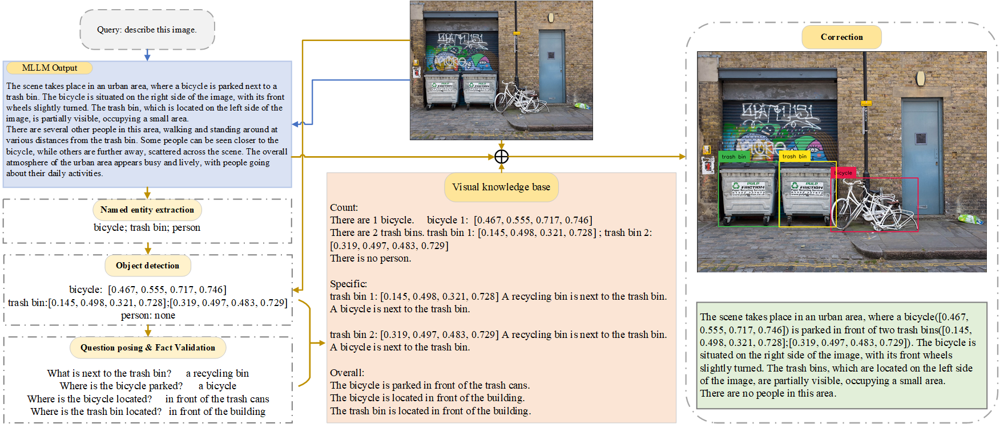
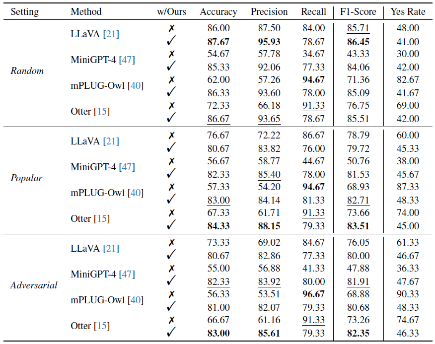
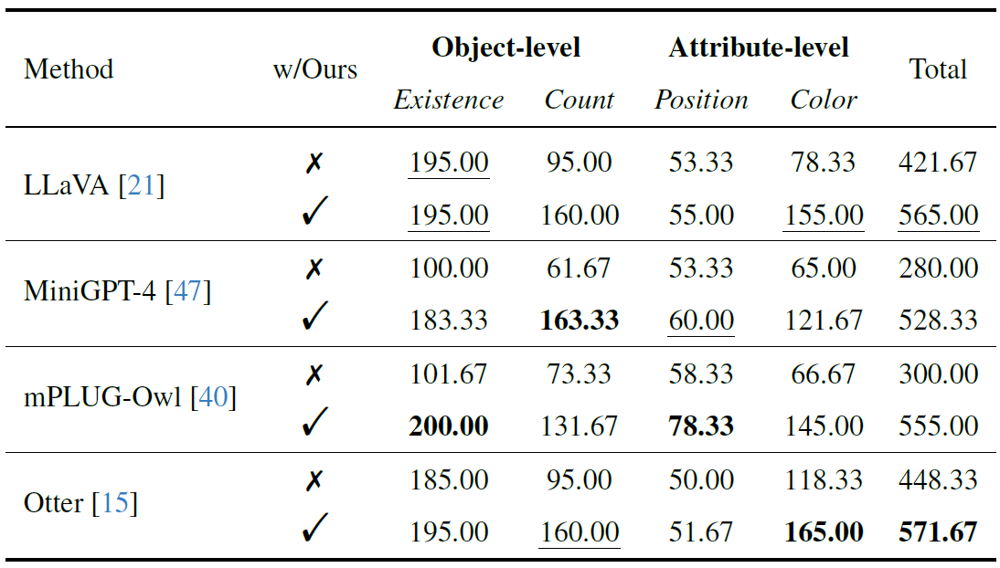
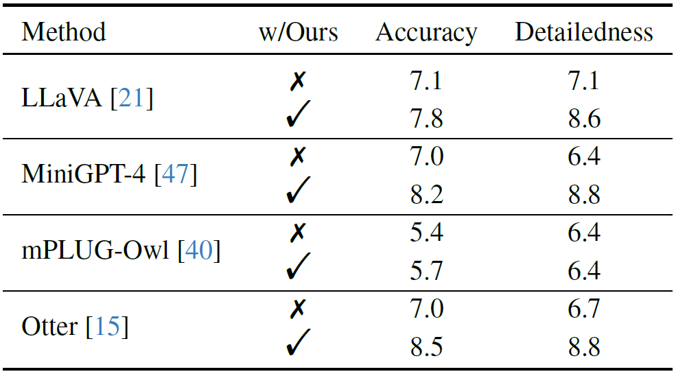

# Woodpecker: Hallucination Correction for Multimodal Large Language Models

<p align="center">
    
</p>


<font size=7><div align='center' > :grapes: \[[Read our arXiv Paper](https://arxiv.org/pdf/2310.16045.pdf)\] &nbsp; :apple: \[[Try our Demo](https://d810a2cbf06856cc91.gradio.live/)\] </div></font>

-----------------

<p align="center">
    
</p>

> Hallucination is a big shadow hanging over the rapidly evolving Multimodal Large Language Models (MLLMs), referring to the phenomenon that the generated text is inconsistent with the image content. In order to mitigate hallucinations, existing studies mainly resort to an instruction-tuning manner that requires retraining the models with specific data. In this paper, we pave a different way, introducing a training-free method named Woodpecker. Like a woodpecker heals trees, it picks out and corrects hallucinations from the generated text. Concretely, Woodpecker consists of five stages: key concept extraction, question formulation, visual knowledge validation, visual claim generation, and hallucination correction. Implemented in a post-remedy manner, Woodpecker can easily serve different MLLMs, while being interpretable by accessing intermediate outputs of the five stages. We evaluate Woodpecker both quantitatively and qualitatively and show the huge potential of this new paradigm. On the POPE benchmark, our method obtains a 30.66%/24.33% improvement in accuracy over the baseline MiniGPT-4/mPLUG-Owl.

This is the first work to correct hallucination in multimodal large language models. If you have any question, please feel free to email bradyfu24@gmail.com or add weChat ID xjtupanda.


## 🌋 Evaluation
We perform experiments based on four baseline models:
- [LLaVA](https://github.com/haotian-liu/LLaVA), [mPLUG-Owl](https://github.com/X-PLUG/mPLUG-Owl), [Otter](https://github.com/Luodian/Otter), [MiniGPT-4](https://github.com/Vision-CAIR/MiniGPT-4)

The experimental results are shown below. For more details, please check out [our paper](https://arxiv.org/pdf/2310.16045.pdf).

<p align="center">
    
</p>

### 📍 POPE Result

This part focuses on object-level hallucinations.
<p align="center">
    
</p>

### 📍 MME Result

This part focuses on both object- and attribute-level hallucinations.
<p align="center">
    
</p>

### 📍 LLaVA-QA90 Result

We also propose to perform open-ended evaluation directly via the recently opened GPT-4V interface. We design two metrics: accuracy and detailedness.
<p align="center">
    
</p>


## ▶️ Demo
Please feel free to try our [Online Demo](https://d810a2cbf06856cc91.gradio.live/)!

<p align="center">

</p>

## 🛠️ Preliminary

1. Create conda environment

```bash
conda create -n corrector python=3.10
conda activate corrector
pip install -r requirements.txt
```

2. Install required packages and models

- Install `spacy` and relevant model packages, following the instructions in [Link](https://github.com/explosion/spaCy). This is used for some text processing operations.

```bash
pip install -U spacy
python -m spacy download en_core_web_lg
python -m spacy download en_core_web_md
python -m spacy download en_core_web_sm
```
- For our **Open-set Detector**. Install GroundingDINO following the instructions in [Link](https://github.com/IDEA-Research/GroundingDINO).

## ⭐ Usage

**1. Inference**

To make corrections based on an image and a text output from MLLM, run the inference code as follows:

```Shell
python inference.py \
        --image-path {path/to/image} \
        --query "Some query.(e.x. Describe this image.)" \
        --text "Some text to be corrected." \
        --detector-config "path/to/GroundingDINO_SwinT_OGC.py" \
        --detector-model "path/to/groundingdino_swint_ogc.pth" \
        --api-key "sk-xxxxxxx" \

```
The output text will be printed in the terminal, and intermediate results saved by default as ```./intermediate_view.json```.

***

**2. Demo setup**

We use mPLUG-Owl as our default MLLM in experiments. If you wish to replicate the online demo, please clone the [project](https://github.com/X-PLUG/mPLUG-Owl) and modify the variables in https://github.com/BradyFU/Woodpecker/blob/e3fcac307cc5ff5a3dc079d9a94b924ebcdc2531/gradio_demo.py#L7 and  https://github.com/BradyFU/Woodpecker/blob/e3fcac307cc5ff5a3dc079d9a94b924ebcdc2531/gradio_demo.py#L35-L36

Then simply run:

```bash
CUDA_VISIBLE_DEVICES=0,1 python gradio_demo.py
```
Here we put the corrector components on GPU with id 0 and mPLUG-Owl on GPU with id 1.


## 🌻 Acknowledgement
This repository benefits from [mPLUG-Owl](https://github.com/X-PLUG/mPLUG-Owl), [GroundingDINO](https://github.com/IDEA-Research/GroundingDINO), [BLIP-2](https://huggingface.co/Salesforce/blip2-flan-t5-xxl), and [LLaMA-Adapter](https://github.com/OpenGVLab/LLaMA-Adapter). Thanks for their awesome works.


## 📑 Citation
If you find our project helpful to your research, please consider citing:
```
@article{yin2023woodpecker,
  title={Woodpecker: Hallucination Correction for Multimodal Large Language Models},
  author={Yin Shukang and Fu Chaoyou and Zhao Sirui and Xu Tong and Wang Hao and Sui Dianbo and Shen Yunhang and Li Ke and Sun Xing and Chen Enhong},
  journal={arXiv preprint arXiv:2310.16045},
  year={2023}
}
```

